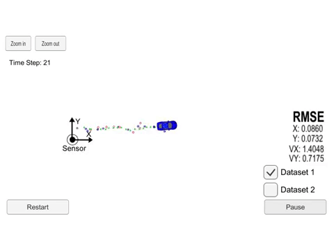

# Unscented Kalman Filter
> 
> [Full Video](https://youtu.be/aHv7-UUtn6A) on YouTube

# Objective
> Utilize an Unscented Kalman Filter to estimate the state of a moving
object of interest with noisy lidar and radar measurements. Passing the
project requires obtaining RMSE values that are lower that the tolerance
 outlined in the project rubric.

# What I Learned
> - UKF implimentation
> - Bayes Theorm
> - Sensor Fusion: Radar and Lidar
> ### Languages
> - C++